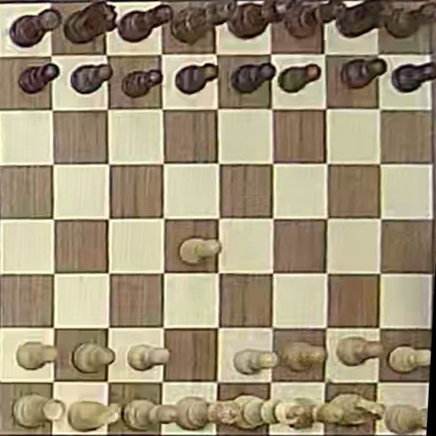
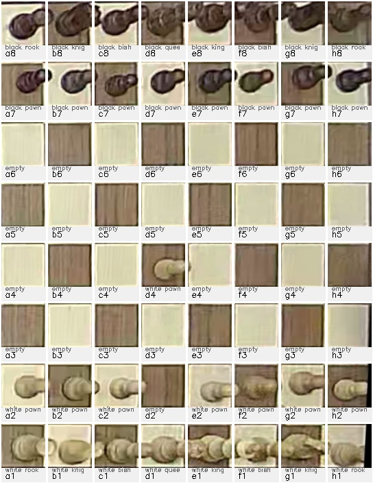
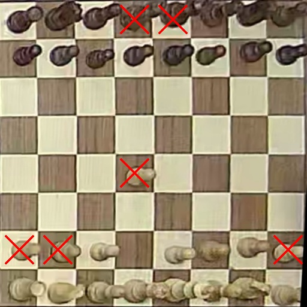
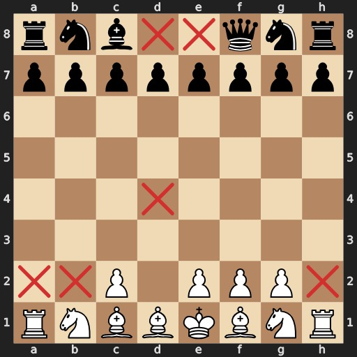

# ♟️ Chessboard Recognition

**Classify chess pieces from real board images and reconstruct the board state in FEN notation.**

*Deep Learning Project - Ben-Gurion University 2026*  
*Authors: Rotem Arie • David Paster • Shon Grinberg*

---

## 🌐 Live Demo

**Try the interactive web app:** [chessboard-recon.streamlit.app](https://chessboard-recon.streamlit.app/)

Upload your own chessboard image and see the complete pipeline in action!

---

## 📸 What It Does

Takes a photo of a chessboard → Identifies each piece → Outputs the board state



---

## 🚀 Quick Start

### 1. Clone the Repository

```bash
git clone https://github.com/rotemarie/chessboard-recon.git
cd chessboard-recon
```

### 2. Setup Python Environment

```bash
# Create virtual environment
python3 -m venv bguenv

# Activate virtual environment
source bguenv/bin/activate  # macOS/Linux
# OR
bguenv\Scripts\activate     # Windows

# Upgrade pip
pip install --upgrade pip

# Install dependencies
pip install -r requirements.txt
```

**Requirements:**
- Python 3.8+ (tested on 3.10)
- 4GB+ RAM
- ~2GB disk space for data
- GPU optional (training is much faster with CUDA)

### 3. Get the Data

**Option A: Download Pre-processed Dataset (Recommended - fastest)**

1. Go to [Google Drive](https://drive.google.com/drive/folders/1WBEpr_TlmAv0hlVfa9ORQXABOIlqjwWz?usp=sharing)
2. Download `dataset_blocks_black.zip` (~308 MB)
3. Extract to project root:
   ```bash
   unzip dataset_blocks_black.zip -d .
   # This creates dataset_blocks/ folder with train/val/test splits
   ```

**Option B: Process from Raw Data (If you want to experiment with preprocessing)**

1. Download raw data from [Google Drive](https://drive.google.com/drive/folders/1WBEpr_TlmAv0hlVfa9ORQXABOIlqjwWz?usp=sharing)
2. Extract to `data/` folder
3. Run preprocessing:
   ```bash
   cd preprocessing
   
   # Create 3×3 block crops (~10-15 minutes)
   python create_block_dataset.py
   
   # Split into train/val/test by game
   python split_dataset.py \
     --preprocessed-root ../preprocessed_data_blocks \
     --output-root ../dataset_blocks
   
   cd ..
   ```

**Verify data is ready:**
```bash
ls dataset_blocks/
# Should see: train/  val/  test/  split_info.json

ls dataset_blocks/train/
# Should see 13 class folders: black_bishop, black_king, ..., empty
```

### 4. Train the Model (Optional - pre-trained model included)

The repository includes a pre-trained ResNet18 model (`model/resnet18_ft_blocks_black.pth`) achieving **89.08% validation accuracy**.

**To reproduce the results or train from scratch:**

```bash
cd training

# ResNet18 Fine-Tuning (Method used in this project)
python train.py \
  --data-dir ../dataset_blocks \
  --model resnet18 \
  --batch-size 16 \
  --epochs 100 \
  --patience 10 \
  --lr 0.001 \
  --checkpoint-dir ../checkpoints

cd ..
```

**Key Training Details:**
- **Architecture**: ResNet18 (11M parameters)
- **Training Mode**: Fine-tuning (all layers trainable)
- **Optimizer**: SGD with momentum (0.9)
- **Learning Rate**: 0.001 with StepLR scheduler
- **Class Balancing**: Weighted random sampling
- **Early Stopping**: Patience of 10 epochs
- **Data Augmentation**: Random horizontal/vertical flips

**Expected Training Time:**
- GPU (NVIDIA RTX 3080): ~1-2 hours
- CPU: ~8-12 hours
- Convergence: Usually by epoch 15-20

**Output:** `checkpoints/best_model.pth` (best validation accuracy)

**Additional Options** (for experimentation):
- `--batch-size 32`: Larger batch (requires more GPU memory)
- `--no-weighted-sampler`: Disable class balancing
- `--experiment-name "my_run"`: Track training on Comet.ml
- Other architectures available: `resnet50`, `vgg16` (ResNet18 performed best)

### 5. Evaluate the Model

```bash
cd training

# Evaluate on validation set
python evaluate.py \
  --checkpoint ../model/resnet18_ft_blocks_black.pth \
  --model resnet18 \
  --data-dir ../dataset_blocks \
  --split val \
  --output-dir ../evaluation_results

# Evaluate on test set
python evaluate.py \
  --checkpoint ../model/resnet18_ft_blocks_black.pth \
  --model resnet18 \
  --data-dir ../dataset_blocks \
  --split test \
  --output-dir ../evaluation_results

cd ..
```

**Evaluation Outputs:**
- `{split}_classification_report.txt` - Per-class precision/recall/F1
- `{split}_confusion_matrix.png` - Confusion matrix visualization
- `{split}_per_class_metrics.png` - Bar charts for each metric
- `{split}_confidence_distribution.png` - Confidence score analysis

### 6. Run Inference

**Try the Live Demo:** [chessboard-recon.streamlit.app](https://chessboard-recon.streamlit.app/)

The app is already deployed! Upload your own chessboard image and test the full pipeline without any setup.

**Or run locally:**

**Option A: Interactive Web UI (Local)**

```bash
streamlit run app.py
```

Opens interactive web app at `http://localhost:8501`!

Upload your own chessboard image and see:
- Board detection and warping
- 64 block crops (3×3 context)
- Piece classification with confidence scores
- FEN notation output
- Reconstructed board visualization

**Option B: Command Line**

```bash
python -m inference.pipeline \
  --image path/to/your/image.jpg \
  --output-dir outputs \
  --save-crops \
  --save-grid \
  --save-clean-board
```

**Output files in `outputs/`:**
- `fen.txt` - FEN notation with OOD detection (`?` for low confidence)
- `fen_clean.txt` - Standard FEN (treats uncertain squares as empty)
- `board.svg` - Board visualization with OOD markers
- `board_clean.svg` - Clean board visualization
- `warped_board.jpg` - Detected and warped board
- `crops/` - Individual 192×192 block crops
- `crops_grid.jpg` - 8×8 grid visualization
- `predictions.json` - Per-square labels and confidences

---

## Usage

### Command Line Inference

```bash
python -m inference.pipeline --image image3.jpg --class-dir dataset/train --output-dir outputs --save-crops --save-grid --save-clean-board
```

**What you get in `outputs/`:**
- `fen.txt` - FEN string (uses `?` for unknown squares)
- `board.svg` - board visualization rendered from the FEN (open in a browser)
- `predictions.json` - per-square labels and confidences
- `warped_board.jpg` - top-down warped board
- `crops/` - 64 block crops (optional)
- `crops_grid.jpg` - separated 8x8 grid of block crops (optional)
- `fen.svg` - clean board visualization (no X markers, optional)
- `fen_clean.txt` - standard FEN with unknowns treated as empty (optional)

### Flags

- `--image` Path to the input image (required).
- `--model` Path to the model checkpoint (default: `model/resnet18_ft_blocks_black.pth`).
- `--class-dir` Directory with class subfolders (ImageFolder order).
- `--classes-file` Text file with class names, one per line (default: `model/classes.txt`).
- `--output-dir` Output directory for artifacts (default: `outputs`).
- `--threshold` Confidence threshold for OOD (default: `0.5`).
- `--board-size` Size of the warped board in pixels (default: `512`).
- `--render-size` Size of the rendered board SVG (default: `512`).
- `--save-crops` Save per-square crops (block context) to disk.
- `--crops-dir` Custom directory for crops (default: `outputs/crops`).
- `--save-grid` Save a separated 8x8 grid of block crops as `outputs/crops_grid.jpg`.
- `--save-clean-board` Save `fen.svg` and `fen_clean.txt` without X markers.
- `--print-squares` Print square indices, positions, and shapes.

**Notes:**
- If the model file is not at `model/resnet18_ft_blocks_black.pth`, pass `--model` explicitly.
- Class order must match training: `model/classes.txt` is preferred; if using `--class-dir`, folder names are sorted.
- Use `--save-clean-board` if you want a standard FEN string with empty squares (no `?`).

---

## 🎯 How It Works

### **Step 1: Board Detection**

Finds the chessboard in the image using edge detection and applies perspective transform.



**Technical Details:**
- Canny edge detection → contour finding
- Perspective transform to 512×512 top-down view
- Fallback method for difficult lighting

### **Step 2: Block Extraction**

Extracts 64 block crops (3x3 context, 192x192) centered on each target square.

```
512x512 board -> 8x8 grid -> 64 blocks (3x3 squares each)
Ordering: a8, b8, ..., h8, a7, ..., h1 (matches FEN)
```

### **Step 3: Classification**

Fine-tuned ResNet18 classifies each block crop (center square) into 13 classes:

**13 Classes:**
- 1× `empty`
- 6× white pieces: `white_pawn`, `white_knight`, `white_bishop`, `white_rook`, `white_queen`, `white_king`
- 6× black pieces: `black_pawn`, `black_knight`, `black_bishop`, `black_rook`, `black_queen`, `black_king`



**Model Details:**
- **Architecture:** ResNet18 (11M parameters)
- **Training:** Fine-tuned all layers with weighted sampling
- **Accuracy:** 89.08% on validation set
- **OOD Detection:** Confidence thresholding (<0.5 → "unknown")

### **Step 4: FEN Reconstruction**

Converts predictions to standard chess notation.



**FEN Example:**
```
rnbqkbnr/pppppppp/8/8/8/8/PPPPPPPP/RNBQKBNR
```

---

## 📊 Results

### Dataset Statistics

- **Total Frames:** 517 labeled frames across 5 games
- **Total Squares:** ~30,000 after preprocessing (92% success rate)
- **Train/Val/Test Split:** 70% / 15% / 15% (split by game)

### Model Performance

| Model | Mode | Val Accuracy | Parameters |
|-------|------|--------------|------------|
| **ResNet18** | **Fine-tune** | **89.08%** | 11M |
| ResNet18 | Transfer | 86.43% | 11M |
| ResNet50 | Fine-tune | 87.96% | 23M |
| VGG16 | Transfer | 85.71% | 138M |

### Per-Class Performance (ResNet18 Fine-tuned)

| Class | Precision | Recall | F1-Score |
|-------|-----------|--------|----------|
| Empty | 0.94 | 0.96 | 0.95 |
| Kings & Queens | 0.92-0.95 | 0.90-0.93 | 0.91-0.94 |
| Rooks & Knights | 0.90-0.92 | 0.88-0.90 | 0.89-0.91 |
| Bishops | 0.88-0.89 | 0.86-0.87 | 0.87-0.88 |
| Pawns | 0.86-0.87 | 0.84-0.85 | 0.85-0.86 |

**OOD Detection:**
- True Positive Rate (occluded detected): 85.4%
- False Positive Rate (clean rejected): 4.8%
- Method: Confidence thresholding (threshold = 0.50)

---

## 🗂️ Project Structure

```
chessboard-recon/
├── data/                      # Raw images + FEN labels (download separately)
├── preprocessing/             # Data processing pipeline
│   ├── board_detector.py     # Board detection & warping
│   ├── square_extractor.py   # Square extraction & FEN parsing
│   ├── preprocess_data.py    # Main preprocessing script
│   └── split_dataset.py      # Train/val/test splitting
├── training/                  # Model training
│   ├── model.py              # ResNet18/50, VGG16 architectures
│   ├── train.py              # Training script
│   ├── evaluate.py           # Evaluation & metrics
│   └── utils.py              # Data loading helpers
├── inference/                 # Full inference pipeline
│   └── pipeline.py           # Image → FEN conversion
├── dataset/                   # Processed data (created after setup)
│   ├── train/
│   ├── val/
│   └── test/
├── checkpoints/               # Saved models
├── model/                     # Deployed model for Streamlit
│   ├── resnet18_ft_blocks_black.pth  # Best model weights (block model)
│   └── classes.txt           # Class names
├── plots/                     # Training visualization plots
├── output/                    # Demo images
├── app.py                     # Streamlit web interface
├── requirements.txt           # Python dependencies
└── README.md                  # This file
```

---

## 🛠️ Technical Details

### Preprocessing

**Board Detection:**
1. Grayscale → Gaussian blur
2. Canny edge detection (thresholds: 50, 150)
3. Contour finding → filter for quadrilaterals
4. Order corners: [TL, TR, BR, BL]
5. Perspective transform → 512×512 square

**Key Challenge:** Consistent corner ordering for proper orientation.

**Solution:** Use coordinate sums/differences:
- Top-left: `min(x + y)`
- Bottom-right: `max(x + y)`
- Top-right: `min(x - y)`
- Bottom-left: `max(x - y)`

### Training

**Data Augmentation:**
- Random horizontal flip
- Random vertical flip
- Normalization (ImageNet mean/std)

**Class Balancing:**
- Weighted random sampling (inversely proportional to class frequency)
- Ensures equal representation during training

**Training Hyperparameters:**
- Optimizer: SGD (momentum=0.9, lr=0.001)
- Scheduler: StepLR (step_size=7, gamma=0.1)
- Early stopping: patience=10 epochs
- Batch size: 16

### Out-of-Distribution Detection

**Problem:** Occluded pieces (hands, shadows) should be marked as "unknown", not misclassified.

**Solution:** Maximum Softmax Probability (MSP)
```python
confidence = max(softmax(logits))
if confidence < 0.50:
    prediction = "unknown"
```

**Performance:** 85% of occluded pieces detected, 5% false alarm rate on clean images.

---

## 📚 References

- **OpenCV:** [docs.opencv.org](https://docs.opencv.org/)
- **PyTorch:** [pytorch.org](https://pytorch.org/)
- **FEN Notation:** [Wikipedia](https://en.wikipedia.org/wiki/Forsyth%E2%80%93Edwards_Notation)
- **ResNet:** He et al., "Deep Residual Learning for Image Recognition" (CVPR 2016)

---

## 📄 License

Educational project for "Introduction to Deep Learning" course at Ben-Gurion University.
